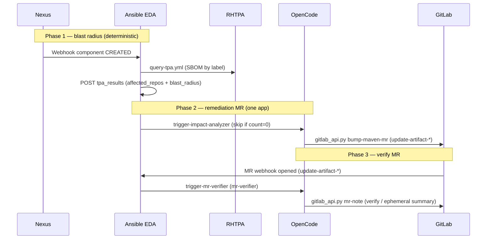

# SDLC agent remediation demo

Autonomous software supply chain remediation using **OpenCode** on OpenShift, driven by **Ansible EDA**. See **[spec.md](spec.md)** for the full system design.

**GitLab mutations** use **`python3 /app/scripts/gitlab_api.py`** with a cluster **`GITLAB_PAT`** (copied from the GitLab root PAT by the tenant chart). Do not use GitLab MCP on workshop GitLab 17.x (official MCP needs ≥18.6). Credentials: [.opencode/reference/gitlab-credentials.md](.opencode/reference/gitlab-credentials.md).

**Triggers:** Nexus and GitLab **webhooks → Ansible EDA** → OpenCode. **Infra:** Argo CD via **`lightwell-workshop`** `bootstrap-infra` + `bootstrap-tenant` only ([`gitops/DEPRECATED.md`](gitops/DEPRECATED.md)). This repo is **SCM** (rulebooks, playbooks, agents, image).

## Demo flow (depth A — blast radius + one app)

Artifact ingress is **Sonatype Nexus** repository webhooks (Lightwell `redhat-packages-*` repos). EDA runs [`rulebooks/sdlc-remediation.yml`](rulebooks/sdlc-remediation.yml); Controller playbooks live under [`playbooks/`](playbooks/).

**Canonical app:** [`lw-demo-help-app`](https://github.com/sshaaf/lw-demo-help-app) → tenant GitLab `lightwell/lw-demo-help-app-<guid>` (seeded automatically by Job `create-gitlab-tenant`). Detailed smoke notes: [`docs/DEMO-A-SMOKE.md`](docs/DEMO-A-SMOKE.md).



| Step | What happens |
|------|----------------|
| 1 | Nexus publishes to a **validated** or **remediated** repo; webhook hits **EDA** (`EDA_WEBHOOK_URL` / Route). |
| 2 | Rule → **`playbooks/query-tpa.yml`**: TPA SBOM by label → `tpa_results` (`blast_radius.count`, `affected_repos`). Demo A uses `blast_radius_mode: single_app_demo_a`. |
| 3 | If `count >= 1` → **`trigger-impact-analyzer.yml`** → OpenCode **`impact-analyzer`** / skill **`dependency-impact-remediation`** for `affected_repos[0]` (help-app). |
| 4 | Agent opens a GitLab **MR** on branch **`update-artifact-*`** via **`gitlab_api.py bump-maven-mr`**, with agent-handoff JSON in the description. |
| 5 | GitLab **MR webhook** → EDA → **`trigger-mr-verifier.yml`** → OpenCode **`mr-verifier`** / skill **`mr-verify-ephemeral`**. |
| 6 | Agent uses **`oc`** (baked into the image) for isolated verify Jobs / ephemeral NS when templates and RBAC allow, then posts an MR note. **No promote-to-prod in demo A.** |

Negative check: unrelated GAV → `count: 0` → no impact-analyzer session.

### Simulated Demo A (no Lightwell publish)

After the tenant is healthy, POST a Nexus-shaped payload to the EDA Route:

```bash
GUID=7jtxj-1   # your lab guid
EDA="https://sdlc-remediation-${GUID}-aap.apps.$(oc get ingresses.config.openshift.io cluster -o jsonpath='{.spec.domain}')/"

curl -sk -X POST "$EDA" -H 'Content-Type: application/json' -d '{
  "action": "CREATED",
  "component": {
    "name": "com.fasterxml.woodstox:woodstox-core",
    "version": "6.0.3.rhlw-00001",
    "format": "maven2"
  }
}'
```

Expect Controller jobs **SDLC Query TPA** → **SDLC Trigger Impact Analyzer** → MR on `lightwell/lw-demo-help-app-<guid>` → **SDLC Trigger MR Verifier**.

### GitOps prep

1. Sync **`lightwell-workshop`** `bootstrap-infra` then `bootstrap-tenant` (Argo).
2. Set tenant `sdlc.scmUrl` to this repo; pin `sdlc.opencodeImage` to `quay.io/sshaaf/sdlc-opencode:sha-<short>`.
3. Inject Lightwell Network + LLM secrets (`inject-env-secrets.sh`); Job **`sync-gitlab-pat`** copies the GitLab root PAT into `gitlab-root-pat` for OpenCode.
4. Help-app is seeded by **`create-gitlab-tenant`** (no manual clone required). Optional laptop fallback: `scripts/seed-help-app-to-gitlab.sh`.

## Demo validation (after provision)

Use the workshop script against a live tenant once GitLab, AAP/EDA, Nexus, and OpenCode are up.

```bash
# from lightwell-workshop (oc logged into the lab cluster)
cd lightwell-workshop

# 1) Static wiring: OpenCode, EDA activation, webhooks, Controller JTs
./automation/gitops/bootstrap-tenant/scripts/verify-sdlc-flow.sh <guid>

# 2) Connectivity only (POST ping to EDA; does not launch remediation jobs)
./automation/gitops/bootstrap-tenant/scripts/verify-sdlc-flow.sh <guid> --smoke

# 3) Rule payloads (launches Query TPA / Impact / Verifier JTs — use on a clean lab)
./automation/gitops/bootstrap-tenant/scripts/verify-sdlc-flow.sh <guid> --smoke --smoke-rules

# 4) Remove artifacts recorded by the last --smoke-rules run
./automation/gitops/bootstrap-tenant/scripts/verify-sdlc-flow.sh <guid> --cleanup
```

| Flag | Effect |
|------|--------|
| _(none)_ | Read-only checks from ConfigMap `tenant-integration`, activation, hooks, JT names |
| `--smoke` | HTTP POST to the in-cluster EDA webhook URL |
| `--smoke-rules` | Posts Nexus / `tpa_results` / GitLab MR-shaped events (starts Controller jobs) |
| `--cleanup` | Deletes jobs / hook side effects recorded under `/tmp/sdlc-verify-<guid>.state` |

Requires `oc`, `curl`, and `python3`. Exit non-zero if any check fails. For a full Demo A story (woodstox MR), prefer the simulated curl above after static verify passes.

Also useful: `./automation/gitops/bootstrap-tenant/scripts/verify-bootstrap-tenant.sh <guid>` for tenant namespaces and Jobs.

## Local development (laptop → lab cluster)

Typical loop when iterating the way we do on a shared lab: edit locally, push SCM/image, redeploy charts via Argo/`oc`, then verify with curl.

### Prerequisites

- `oc` logged into the OpenShift lab (`oc whoami`)
- Clones of **`lightwell-workshop`** (GitOps charts) and this repo (**`lw-sdlc-opencode`**, SCM + image)
- Helm 3 (optional, for `helm template | oc apply` break-glass)
- Workshop secrets: copy `lightwell-workshop/.env.secrets.example` → **`lightwell-workshop/.env.secrets`** (gitignored). `inject-env-secrets.sh` sources that file by default (`ENV_SECRETS` overrides the path).

### 1. Change agents / playbooks / image

```bash
# this repo
git checkout main
# ... edit rulebooks/, playbooks/, .opencode/, scripts/, container/ ...
git push origin main          # CI builds quay.io/sshaaf/sdlc-opencode:sha-<short>

# pin the new tag in the workshop chart (then push demo-update / your lab branch)
# lightwell-workshop/automation/gitops/bootstrap-tenant/values.yaml
#   sdlc.opencodeImage: quay.io/sshaaf/sdlc-opencode:sha-<short>
```

Argo picks up chart changes from the workshop branch (`demo-update` on personal forks). EDA re-imports playbooks from `sdlc.scmUrl` on the next `eda-bootstrap` (or when the activation already matches, bootstrap skips restart).

### 2. Reset and redeploy the platform (optional clean slate)

```bash
cd lightwell-workshop

# stop Argo apps, then tear down tenants + shared infra (Keycloak left intact)
oc delete application lb1815-lightwell lightwell-tenant-<guid> -n openshift-gitops --ignore-not-found --wait=false
LIGHTWELL_RESET_TENANTS=1 LIGHTWELL_RESET_SDLC=1 \
  ./automation/gitops/bootstrap-infra/scripts/reset-lightwell-platform.sh
# wait until gitlab/aap/lightwell-* / sdlc-* namespaces are gone

# recreate Argo Applications pointing at your fork + branch (admin password = lab common password)
# use the same shape as automation/gitops/argocd-application-bootstrap-*.yaml
# names often used on labs: lb1815-lightwell (infra), lightwell-tenant-<guid> (tenant)
```

If Argo sync times out mid-way, apply the chart locally as a fill-in:

```bash
helm template lb1815-lightwell automation/gitops/bootstrap-infra \
  --set deployer.domain=apps.cluster-<cluster>.dyn.redhatworkshops.io \
  --set deployer.storageClass=ocs-external-storagecluster-ceph-rbd-immediate \
  --set admin.password='<lab-password>' \
  --set gitlab.rootPassword='<lab-password>' \
  | oc apply --server-side --force-conflicts -f -
```

### 3. Inject secrets after namespaces exist

The inject script reads a **local** env file (not committed):

| File | Role |
|------|------|
| `lightwell-workshop/.env.secrets.example` | Template in git |
| `lightwell-workshop/.env.secrets` | Your real values (**gitignored**); default path the script loads |
| `ENV_SECRETS=/path/to/file` | Optional override of that path |

```bash
cd lightwell-workshop
cp .env.secrets.example .env.secrets
# edit .env.secrets:
#   LIGHTWELL_NETWORK_USERNAME=...
#   LIGHTWELL_NETWORK_PASSWORD=...
#   OPENAI_API_KEY=...

# namespaces lightwell-nexus-<guid> and sdlc-<guid> must already exist
GUID=<guid> ./automation/gitops/bootstrap-tenant/scripts/inject-env-secrets.sh
# optional: ENV_SECRETS=$PWD/.env.secrets GUID=<guid> ./...
```

What it creates on the cluster:

| From `.env.secrets` | OpenShift Secret |
|---------------------|------------------|
| `LIGHTWELL_NETWORK_*` | `redhat-packages-credentials` in `lightwell-nexus-<guid>` |
| `OPENAI_API_KEY` | `opencode-llm` in `sdlc-<guid>` (and patches Argo/`OPENAI_API_KEY` when needed) |

**Not** from `.env.secrets`: the GitLab API token. Job **`sync-gitlab-pat`** (tenant chart) copies the cluster Secret `gitlab/root-user-personal-token` → `sdlc-<guid>/gitlab-root-pat`, which OpenCode mounts as `GITLAB_PAT`.

### 4. Roll a new OpenCode image without full redeploy

```bash
IMAGE=quay.io/sshaaf/sdlc-opencode:sha-<short>
oc set image deploy/opencode "opencode=${IMAGE}" -n sdlc-<guid>
oc patch deploy opencode -n sdlc-<guid> \
  -p '{"spec":{"template":{"spec":{"containers":[{"name":"opencode","imagePullPolicy":"Always"}]}}}}'
oc rollout status deploy/opencode -n sdlc-<guid>
# also patch the tenant Argo Application helm values opencodeImage so selfHeal does not revert
```

### 5. Test

```bash
./automation/gitops/bootstrap-tenant/scripts/verify-sdlc-flow.sh <guid>
# then simulated Demo A curl (see above) or --smoke / --smoke-rules

# watch agents
oc logs -f -n sdlc-<guid> deploy/opencode
```

## Container image CI

Workflow: [`.github/workflows/ci-opencode-image.yml`](.github/workflows/ci-opencode-image.yml)

| Job | Purpose |
|-----|---------|
| `build` | Docker build (`container/Dockerfile`), tag `sdlc-opencode:ci`, upload artifact |
| `test` | Load image, run [`container/scripts/smoke-test.sh`](container/scripts/smoke-test.sh) (includes `oc` / `kubectl` presence) |
| `publish` | Push to Quay (skipped on pull requests) |
| `release` | GitHub Release on `v*` tags with image coordinates |

### GitHub configuration

| Name | Type | Example |
|------|------|---------|
| `QUAY_IMAGE_NAME` | Variable (optional) | `quay.io/sshaaf/sdlc-opencode` (workflow default) |
| `QUAY_USERNAME` | Secret | Quay robot or user |
| `QUAY_PASSWORD` | Secret | Robot token |

```bash
gh variable set QUAY_IMAGE_NAME --body "quay.io/sshaaf/sdlc-opencode"
gh secret set QUAY_USERNAME --body "YOUR_QUAY_ROBOT_OR_USER"
gh secret set QUAY_PASSWORD --body "YOUR_QUAY_TOKEN"
```

### Local build and smoke test

The Dockerfile copies `opencode.json`, `.opencode/`, and `scripts/` from the **repo root**. The final `.` is required.

```bash
# from repository root
docker build -f container/Dockerfile -t sdlc-opencode:ci .
# or
./container/build.sh

bash container/scripts/smoke-test.sh sdlc-opencode:ci
```

### OpenShift image after CI

```text
quay.io/sshaaf/sdlc-opencode:sha-<short-git-sha>
```

Pin that tag in **`lightwell-workshop`** `automation/gitops/bootstrap-tenant/values.yaml` → `sdlc.opencodeImage` (prefer `sha-*`, not floating `latest`).
