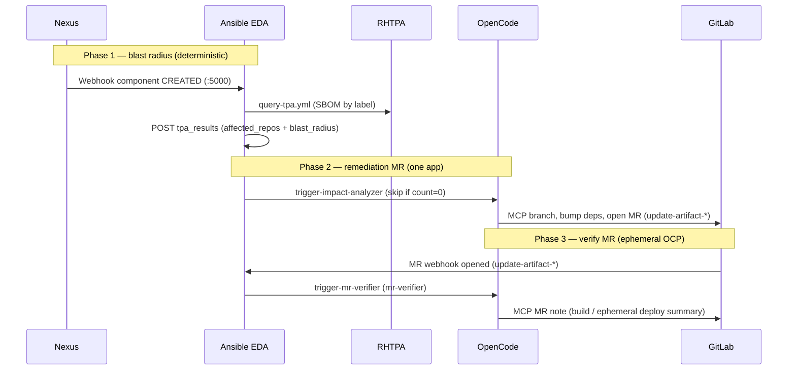

# SDLC agent remediation demo

Autonomous software supply chain remediation using OpenCode on OpenShift. See **[spec.md](spec.md)** for the full system design.

GitLab auth uses **username + password** in cluster Secrets; a PAT is **derived at runtime** when MCP needs it—see [.opencode/reference/gitlab-credentials.md](.opencode/reference/gitlab-credentials.md).

**Agent triggers (current):** Nexus and GitLab **webhooks → Ansible EDA** → OpenCode — see [spec.md §3](spec.md). **Infra:** Argo CD GitOps ([`gitops/`](gitops/README.md)); Ansible is only for EDA rulebooks and event playbooks ([spec.md §1.4](spec.md)). **Not used:** Artifactory (OSS webhooks), Jenkins. **Future option:** GitLab CI in [gitlab/](gitlab/README.md).

## Demo flow (depth A — blast radius + one app)

Artifact ingress is **Sonatype Nexus** repository webhooks (Lightwell `redhat-packages-*` repos). EDA runs [`eda-rulebooks/sdlc-remediation.yml`](eda-rulebooks/sdlc-remediation.yml); playbooks live under [`playbooks/`](playbooks/).

**Canonical app:** [`lw-demo-help-app`](../lightwell-demo-collateral/apps/lw-demo-help-app) → GitLab `lightwell/lw-demo-help-app-<guid>`. Smoke steps: [`docs/DEMO-A-SMOKE.md`](docs/DEMO-A-SMOKE.md).



| Step | What happens |
|------|----------------|
| 1 | Nexus publishes to **validated** or **remediated** repo; webhook hits **EDA** (`EDA_WEBHOOK_URL`). |
| 2 | Rule → **`playbooks/query-tpa.yml`**: TPA blast radius → `tpa_results` (`blast_radius.count`, `affected_repos`). |
| 3 | If `count >= 1` → **`trigger-impact-analyzer.yml`** → OpenCode **`impact-analyzer`** / **`dependency-impact-remediation`** for `affected_repos[0]` (help-app). |
| 4 | Agent opens a GitLab **MR** on branch **`update-artifact-*`** with handoff JSON. |
| 5 | GitLab **MR webhook** → EDA → **`trigger-mr-verifier.yml`** → **`mr-verifier`** / **`mr-verify-ephemeral`**. |
| 6 | Agent runs isolated verify (Job) and optional ephemeral deploy; posts results on the MR. **No promote-to-prod in demo A.** |

**GitOps:** deploy OpenCode/EDA/Nexus/TPA seed via **`lightwell-workshop`** `bootstrap-infra` + `bootstrap-tenant` only ([`gitops/DEPRECATED.md`](gitops/DEPRECATED.md)). This repo is **SCM** (rulebooks, playbooks, agents, image).

**GitOps prep (before the loop runs):** sync workshop bootstrap charts; set tenant `sdlc.scmUrl` to this repo; seed help-app into GitLab (`scripts/seed-help-app-to-gitlab.sh`). See [`docs/DEMO-A-SMOKE.md`](docs/DEMO-A-SMOKE.md).

## Container image CI

Workflow: [`.github/workflows/ci-opencode-image.yml`](.github/workflows/ci-opencode-image.yml)

| Job | Purpose |
|-----|---------|
| `build` | Docker build (`container/Dockerfile`), tag `sdlc-opencode:ci`, upload artifact |
| `test` | Load image, run [`container/scripts/smoke-test.sh`](container/scripts/smoke-test.sh) |
| `publish` | Push to Quay (skipped on pull requests) |
| `release` | GitHub Release on `v*` tags with image coordinates |

### GitHub configuration

| Name | Type | Example |
|------|------|---------|
| `QUAY_IMAGE_NAME` | Variable (optional) | `quay.io/sshaaf/sdlc-opencode` (workflow default) |
| `QUAY_USERNAME` | Secret | Quay robot or user |
| `QUAY_PASSWORD` | Secret | Robot token |

Repository **`sshaaf/sdlc-opencode`** already has placeholders; replace them with real Quay credentials before relying on **publish**:

```bash
gh variable set QUAY_IMAGE_NAME --body "quay.io/sshaaf/sdlc-opencode"
gh secret set QUAY_USERNAME --body "YOUR_QUAY_ROBOT_OR_USER"
gh secret set QUAY_PASSWORD --body "YOUR_QUAY_TOKEN"
```

Verify (names only; values are hidden):

```bash
gh secret list
gh variable list
```

### Local build and smoke test

The Dockerfile copies `opencode.json` and `.opencode/` from the **repo root**. The final `.` is required (without it, Podman/Docker use `container/` as context and `COPY` fails).

```bash
# from repository root
docker build -f container/Dockerfile -t sdlc-opencode:ci .

# or
./container/build.sh

bash container/scripts/smoke-test.sh sdlc-opencode:ci
```

### OpenShift image after CI

After a successful run on `main`, use the immutable tag from Quay:

```text
quay.io/sshaaf/sdlc-opencode:sha-<short-git-sha>
```

Set `OPENCODE_IMAGE` in [`gitops/base/cluster-config/cluster-config.yaml`](gitops/base/cluster-config/cluster-config.yaml) (or your overlay). Prefer `sha-*` or a semver tag from `v*` releases—not `latest` alone in production.

### Manual verification (post-setup)

1. Open a PR to `main` and confirm **build** + **test** pass without **publish**.
2. Configure Quay secrets, merge to `main`, confirm push to Quay.
3. Push git tag `v0.1.0` and confirm GitHub Release + Quay semver tags.
